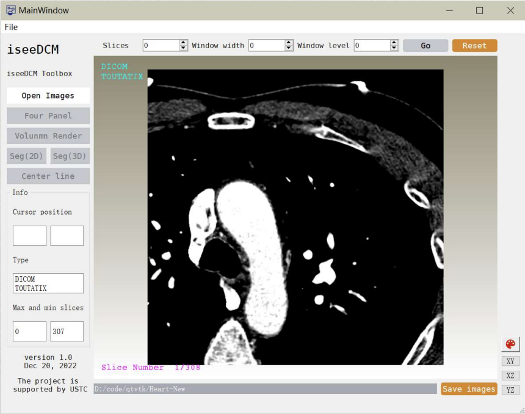
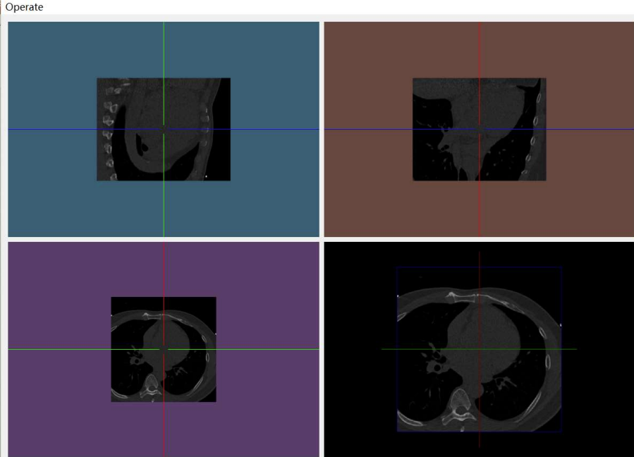
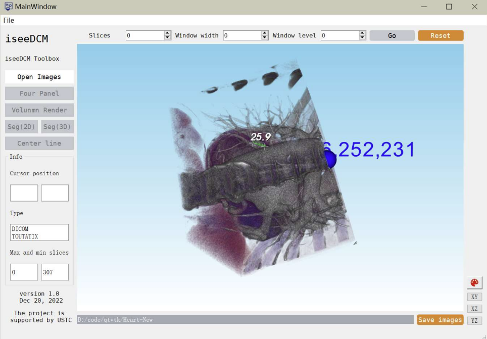
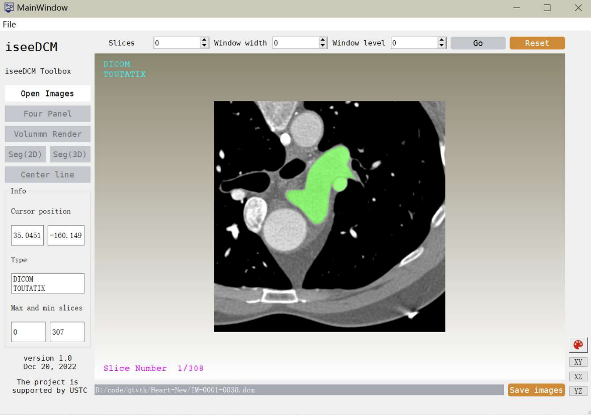
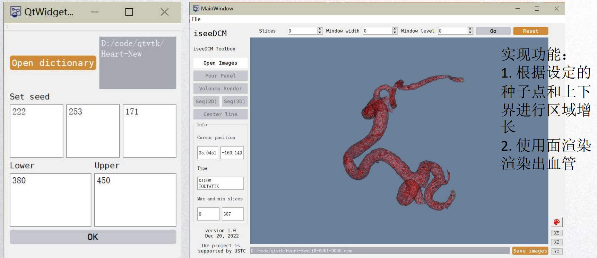

# iseeDCM: 基于QT心脏冠脉可视化应用
iseeDCM是一个具备多功能的医学体数据可视化应用。它基于C++、QT、VTK与ITK搭建。整个软件的功能如下：
### 1. GDCM序列解析功能

**实现功能：**
- 调整窗宽窗位
- 调整切片
- 实时显示序列信息
- 显示最大最小切片数
- 调整XZ，YZ视角
- 彩色图片显示
### 2. 影像交互式三视图

**实现功能：**
1. 四视图显示
2. 每个视角相互转动
3. Reset重置原视角
### 3. 影像体渲染显示功能

**实现功能：**
1. GPU体渲染
2. 鼠标拖动测量距离
3. 鼠标点击显示坐标
### 4. 心脏冠脉2d分割

**实现功能：**
1. 左键点击，选取种子点区域增长分割
2. 右键点击，取消当前分割
3. 选择保存图片，保存已分割的图片
### 5. 影像体渲染显示功能

